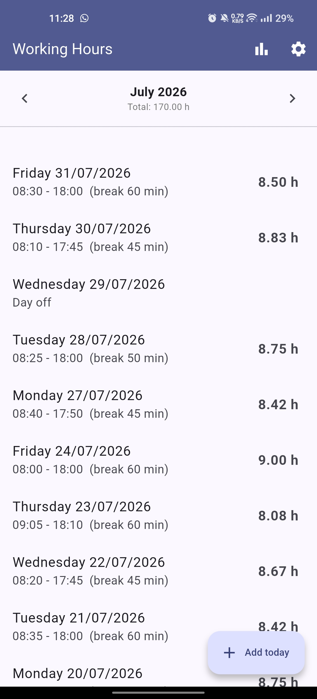
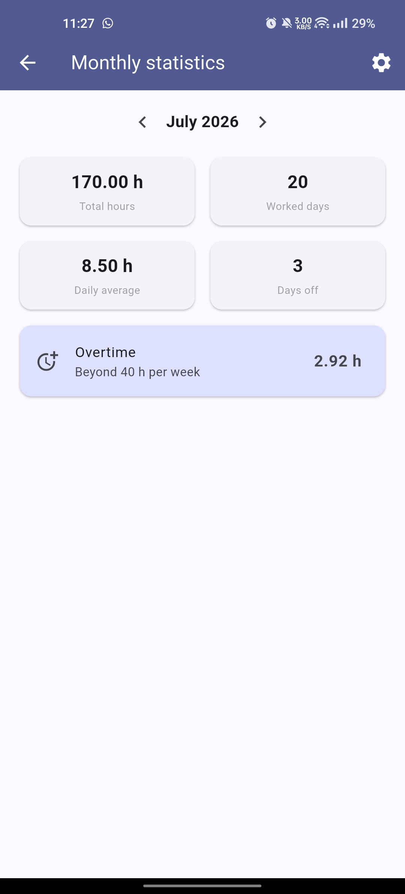
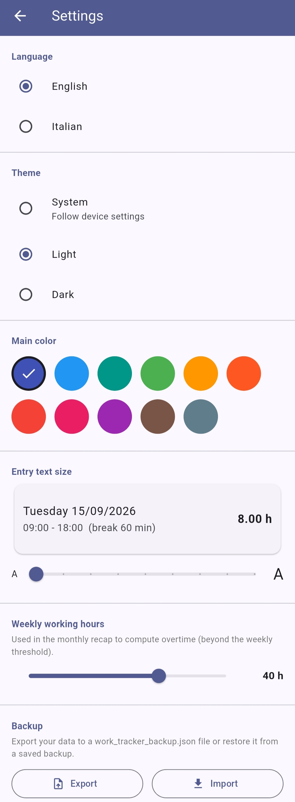

# ⏱️ Work Tracker

A simple offline-first Flutter app for tracking daily working hours and monthly overtime.

The app lets you record clock-in and clock-out times, breaks, days off and notes. It calculates the effective hours worked and provides a monthly summary.

All data is stored locally on the device. No account or server is required.

## Screenshots

| Home | Statistics | Settings |
| :---: | :---: | :---: |
|  |  |  |

## Features

### Daily tracking

* Add today's working hours with one tap.
* Record clock-in, clock-out and break duration.
* Enter the break using either a duration or start/end times.
* Mark a day as a day off.
* Add optional notes.
* Automatically calculate effective working hours.

### Monthly view

* The home screen displays the current month.
* Navigate between months using the arrows or horizontal swipe.
* See the monthly total directly in the header.

### Statistics

The monthly statistics screen shows:

* Total hours worked
* Number of working days
* Daily average
* Days off
* Overtime

Overtime is calculated based on the configured weekly working hours (40 hours by default).

### Personalization

* Light, dark or system theme.
* Select the main app color.
* Adjust the text size used for work entries.
* Configure weekly working hours.

### Backup and restore

* Export all data to a json file.
* Choose where to save the backup on the device.
* Import a previously created backup.
* Ask for confirmation before replacing existing data.

### Languages

The app is available in:

* English
* Italian

The selected language also affects dates and system pickers where supported.

### Data storage

All work entries and settings are stored locally on the device using `shared_preferences`.

There is currently no backend or online synchronization.

## Tech stack

* [Flutter](https://flutter.dev/) with Material 3
* [shared_preferences](https://pub.dev/packages/shared_preferences) for local storage
* [intl](https://pub.dev/packages/intl) for date formatting and localization
* [file_picker](https://pub.dev/packages/file_picker) for backup import/export
* [flutter_launcher_icons](https://pub.dev/packages/flutter_launcher_icons) for app icon generation

## Getting started

Make sure you have the [Flutter SDK](https://docs.flutter.dev/get-started/install) installed.

```bash
git clone <your-repo-url>
cd work_tracker
flutter pub get
flutter run
```

## Build

To build a release APK for Android:

```bash
flutter build apk --release
```

The generated APK can be found at:

```text
build/app/outputs/flutter-apk/app-release.apk
```

## Project structure

```text
lib/
├─ main.dart
├─ models/
│  └─ work_entry.dart
├─ services/
│  ├─ storage_service.dart
│  └─ theme_controller.dart
├─ screens/
│  ├─ home_screen.dart
│  ├─ add_entry_screen.dart
│  ├─ statistics_screen.dart
│  └─ settings_screen.dart
└─ l10n/
```

## License

This project is released for personal use. Feel free to adapt it for your own needs.
